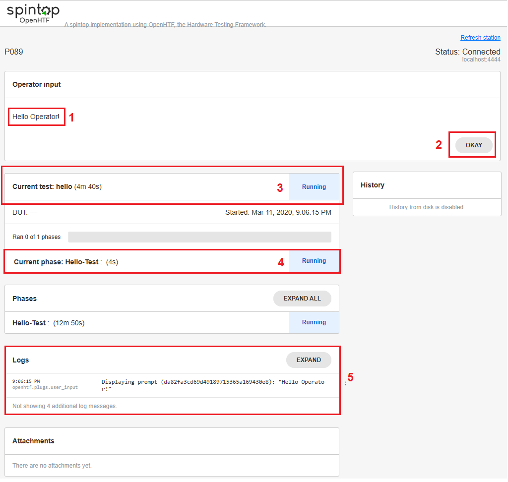
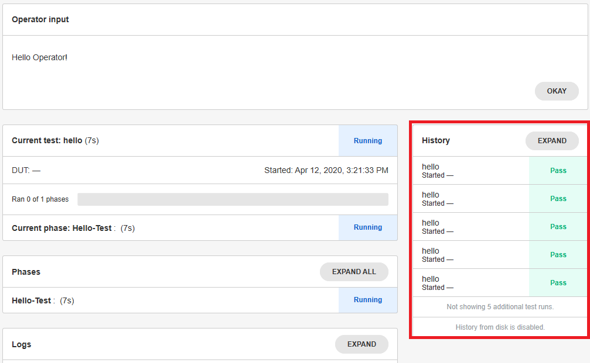
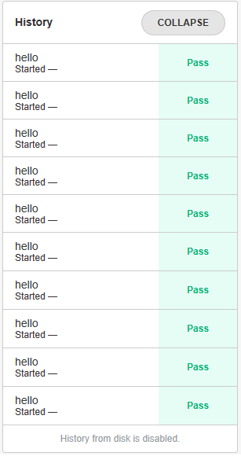
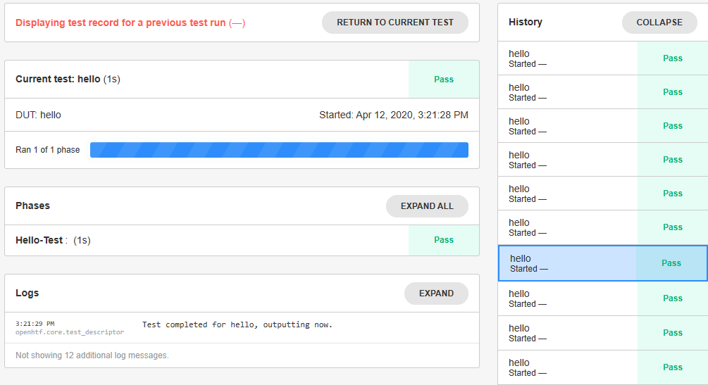

spintop-openhtf uses a web interface to interact with the test operator. 

- It guides him or her through the manual operations to perform on the test bench. 
- It displays the logs and the results of all test phases as well as for the complete test bench.ùs


## Exploration of the Interface

Let's explore the web application. To do so, make sure you have gone through the :ref:`first-testbench-label`. tutorial and run the test bench written in it. In the test bench projet, run

```bat
# Windows Activate
venv\Scripts\activate 

python main.py
```

The web interface should load automatically in your default browser. The following image indicates the different sections of the web interface.



1. The Operator Input section is where the prompts and forms are showcased. The Hello Operator! prompt defines in the test bench appears. 
2. The test will continue (and end) when the tester clicks on the Okay button.
3. The test is shown as running with the elapsed time displayed in real time.
4. The current phase being executed is displayed. The current testbench holds only one test phase. In more complex test plans, the executed and to be executed phases are displayed to facilitate the operator following the test.
5. The test logs list the different operations executed by the test bench as well as the information that was decided to be logged by the test developer. 

## Exploration of Past Results

Run the test a few more times, clicking **OKAY** again and again until 10 tests are executed. Notice that the web application logs the past 5 test results on the right of the interface. T



Hit the **Expand** button on the **History** box to see all past test results.




To access the full results of any of the tests on the list, click on the test you wan to consult. The web application will load the result and display it, phases, logs and everything.




:download:`Tutorial source <../tutorials/main_first_testbench.py>`


